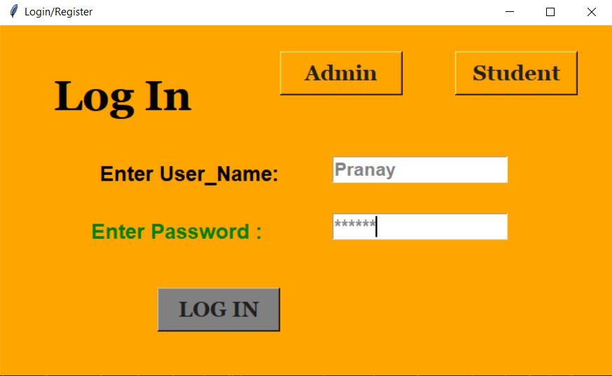
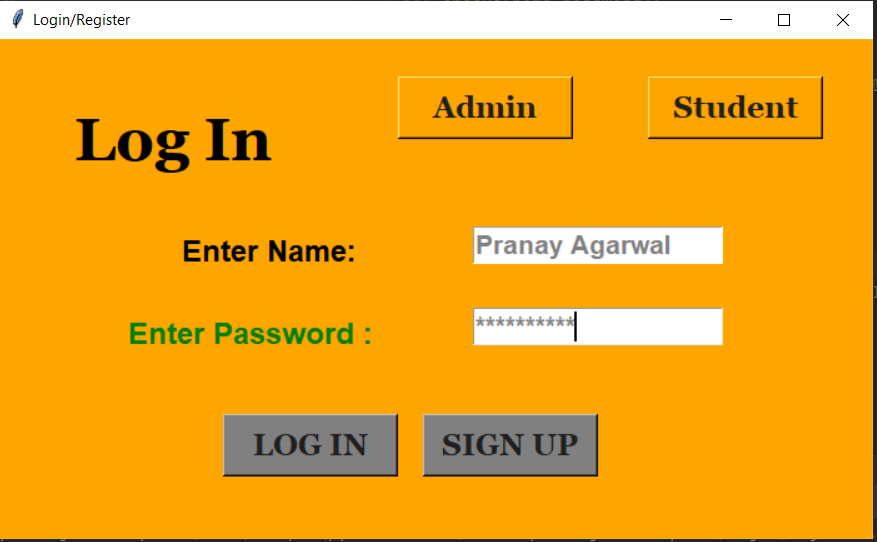
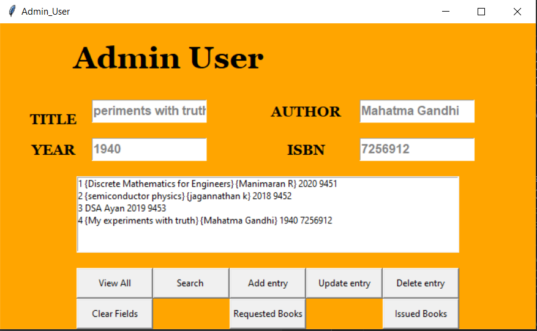
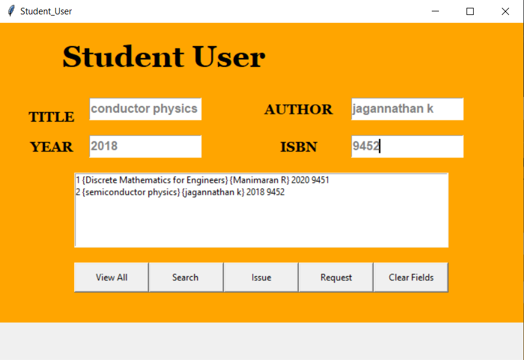
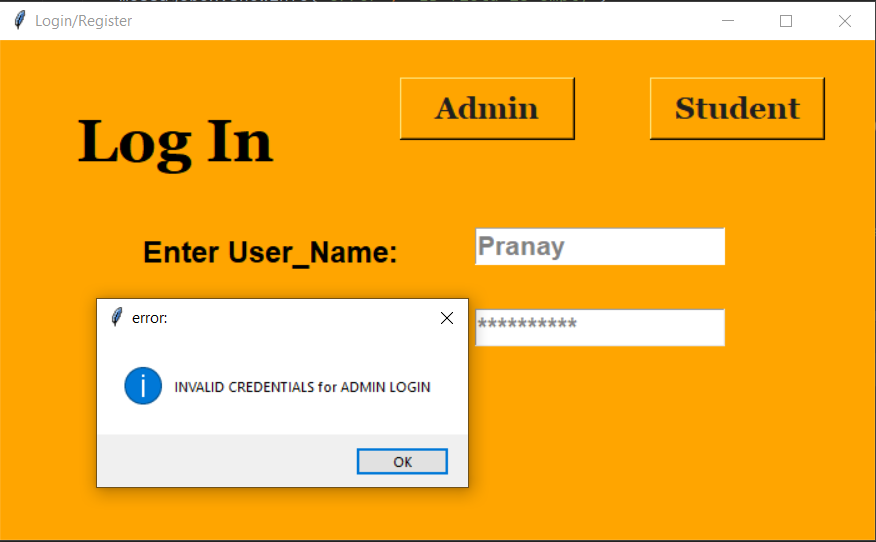

# Library-Management-System
This is a Library Management system built in python using sqlite3 database and tkinter GUI. Provides admin and student functionalities where admin accounts have already been added by me and student can register and then login into the system. The powers that an admin and a student has are same as that of a native Library system.

To install the packages at once, use:
### `pip install -r requirements.txt`

>General Instructions:-

1) To `RUN` the application just execute `login_register.py` file.

2) Default admin username=`Pranay` Password=`srmite` XD (Sorry for a cheeky password)

### IMAGES

>ADMIN LOGIN INTERFACE

>STUDENT REGISTERING INTERFACE

>Admin Working Module

>Student Module

>Password Validating mechanism

